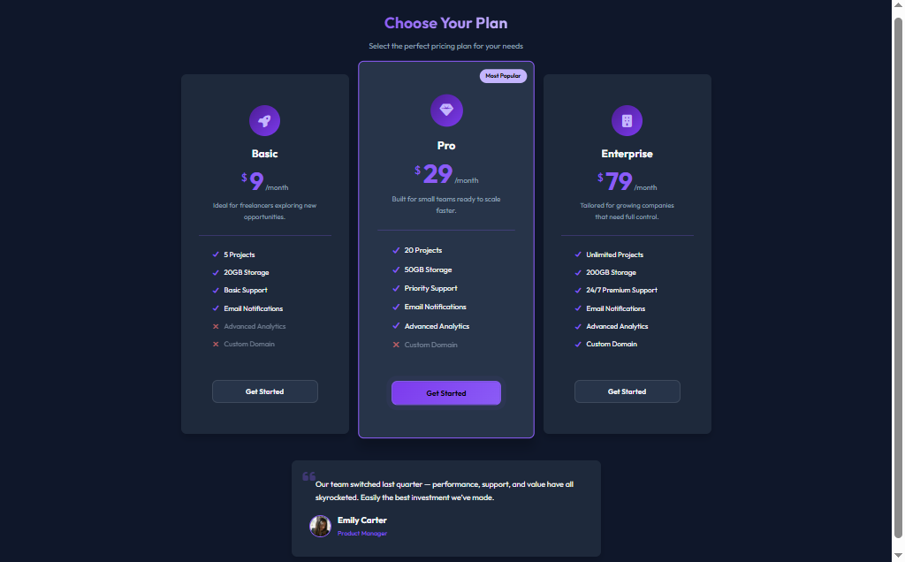

# 💜 Responsive Pricing Cards

A sleek and modern **pricing section** built using **HTML and CSS**, featuring animated gradients, smooth hover effects, and a glowing call-to-action for the highlighted plan. The design is fully responsive and fits perfectly in landing pages or SaaS websites.

## ✨ Features
- Responsive grid layout for pricing tiers  
- Highlighted “Most Popular” Pro plan with pulse animation  
- Smooth hover transitions and gradient themes  
- Testimonial section with avatar and quote  
- Built with pure HTML and CSS — no frameworks

## 🚀 Live Preview
[🔗 View Live](https://laibatariq110.github.io/pricing-cards)  

## 📸 Screenshot

## 🛠️ Technologies Used
- HTML5  
- CSS3 (Custom Properties & Keyframe Animations)  
- Google Fonts (Outfit)  
- Font Awesome Icons
